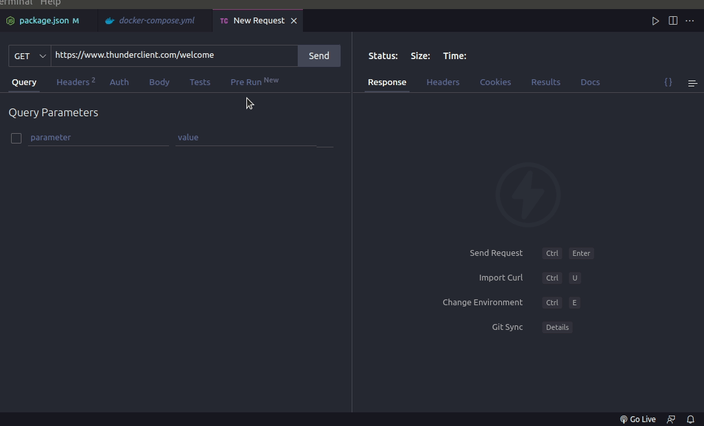

# Boas vindas ao repositório do projeto Trybesmith!

---

Este foi meu primeiro projeto usando TypeScript e aproveitei tambem para poder praticar os principios da orientação a objetos. Neste projeto desenvolvi uma API para simular uma loja de itens medievais!

A aplicação foi desenvolvida em Node usando o framework express e o pacote mysql2 para fazer um CRUD no banco de dados;

A Api foi desenvolvida seguindo a arquitetura de software de camadas MSC (Model Service Controller);

Desenvolvi endpoints que estão conectados ao banco de dados seguindo os princípios do REST;


## 🛠 Tecnologias usadas:

* TypeScript;
* Docker;
* Express;
* Node;
* Mysql2;

## Execute localmente:

Clone o projeto
```bash
git clone git@github.com:yuryss98/project-trybesmith.git
```

Vá para o diretório do projeto:
```bash
cd project-trybesmith
```

Entre no Vs Code para verificar os arquivos usando o atalho no terminal:
```bash
code .
```

Abra O terminal e execute os comandos:
```bash
docker-compose up -d
```

```bash  
docker exec -it trybesmith bash
```

```bash
npm install
```

```bash
npm start
```

## Depois de executar todos os comandos, ja teremos uma aplicação rodando na porta 3000, agora basta usar as query mysql no arquivo Trybesmith.sql para gerar o banco de dados da aplicação e popula-lo!



## Endpoints: todos os endpoints são acessiveis a partir da rota http://localhost:3000

  <details close>
  <summary>GET /products</summary>
  -- O método GET em /products é usado para listar todos os produtos da aplicação;
  
  </details>
  
  <details close>
  <summary>GET /orders</summary>
  -- O método GET em /orders é usado para listar todos os pedidos da aplicação juntamente com o usuario que o solicitou;
  
  </details>
  
  <details close>
  <summary>POST /users</summary>
  
  -- O método POST em /users é usado para criar um usuario, quando criado com sucesso retorna um token, token esse que é usado para poder acessar outras    rotas da api, aceita 4 campos, sendo eles:
  
  -- username: campo do tipo texto -CAMPO OBRIGATORIO;
  
  -- password: campo do tipo texto - CAMPO OBRIGATORIO;
  
  -- vocation: campo do tipo texto - CAMPO OBRIGATORIO;
  
  -- level: campo do tipo number - CAMPO OBRIGATORIO;
  
  EXEMPLO:
  
  ```json
      {
        "username": "teste",
        "vocation": "beserker",
        "level": 100,
        "password": "123456789"
      }
  ```
  
  </details>
  
  <details close>
  <summary>POST /login</summary>
  -- O método POST em /login é usado para fazer login em uma conta ja existente, quando usado corretamente retorna um token, token esse que é usado para poder acessar outras rotas da api, aceita 2 campos, sendo eles:
  
     -- username: campo do tipo texto -CAMPO OBRIGATORIO;
  
     -- password: campo do tipo texto -CAMPO OBRIGATORIO;
  
  EXEMPLO:
  
  ```json
      {
        "username": "teste",
        "password": "123456789
      }
  ```
  
  </details>
  
  <details close>
  <summary>POST /products</summary>
  -- O método POST em /products é usado para fazer criar um novo produto, ele aceita 2 campos sendo eles:
  
     -- name: campo do tipo texto -CAMPO OBRIGATORIO;
  
     -- amount: campo do tipo texto -CAMPO OBRIGATORIO;
  
  EXEMPLO:
  
  ```json
      {
        "name": "Espada de aço valirian",
        "amount": "100 peças de ouro"
      }
  ```
  
  </details>
  
  > :point_right: ## O proximo endpoint necessita do token para funcionar, então lembre-se de salvar o token quando fizer login ou criar um usuario, 
  use o token no header da requisição com a chave "Authorization", lembrando que cada token gerado expira em no máximo 5 horas!
  
  
  <details close>
  <summary>POST /orders</summary>
  -- O método POST em /orders é usado para fazer um novo pedido aceita 1 campo, sendo ele:
  
     -- productsIds: campo do tipo lista -CAMPO OBRIGATORIO, nesse campo você passará os ids dos produtos a qual quer fazer o pedido;
  
  EXEMPLO:
  
  ```json
      {
        "productsIds": [1, 2]
      }
  ```
  
  </details>
  
